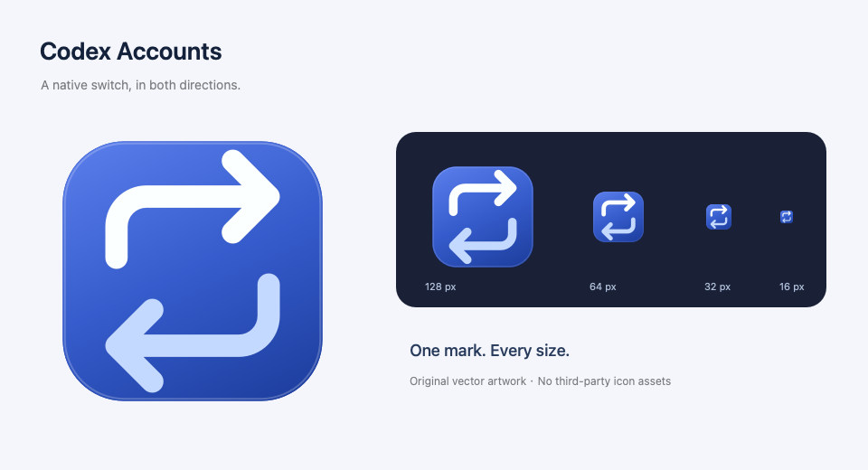

# Codex Accounts for macOS

一个用 SwiftUI 编写的原生 Mac 菜单栏工具，用于保存自己的多个 ChatGPT 登录账号，并通过正常退出、切换认证、重新打开的方式切换 Codex 桌面 App 账号。

**当前状态：0.2.1 开发预览。** 已通过核心自动化测试、真实 Codex 程序的无登录隔离协议测试与演示界面检查。真实账号之间的浏览器登录、额度读取、桌面切换与恢复仍需要用户本机验收。不能将“认证文件已替换”当作“桌面 App 已登录成功”。



## 功能

- 原生双栏窗口与可搜索的菜单栏快速切换面板，支持备注、深浅色和默认隐藏邮箱。
- 从当前认证、选定 JSON 或 OpenAI 浏览器／设备码登录添加账号。
- 凭据与恢复备份保存在本机 Keychain；账号元数据保存在 Application Support。
- 显式刷新额度，保留不同额度桶，未知额度不会显示为零。
- 切换前备份，正常退出桌面 App，原子替换认证后重开；支持恢复与人工核对状态。

## 支持范围

macOS 14+、Swift 5.9+ / Xcode 15+。优先在 Apple Silicon 上验证；Intel 可构建，但尚未进行实机验收。

需要安装官方 Codex 桌面 App。工具通过应用标识 `com.openai.codex` 发现 App，支持应用文件名称变化；使用 App 内置的 Codex 可执行程序，不随包再分发 OpenAI 程序。

第一版支持 ChatGPT 登录凭据，以及 `CODEX_HOME/auth.json` 文件认证（默认目录 `~/.codex`）。**暂不支持** API Key、`keyring` / `auto` / `ephemeral` 认证、共享 app-server 守护进程或受管理的认证策略。检测到这些不兼容情况时会停止切换。设置中的认证目录必须与桌面 App 实际使用的一致。

本工具不会自动判断所有正在运行的任务。点击切换后，需要先确认任务已暂停；如果 App 拒绝退出或其已识别的 Codex 子进程仍在运行，则停止切换，不强制结束桌面进程。其他客户端共用同一认证目录时也可能受到影响。

## 构建与启动

在仓库根目录运行：

```sh
./scripts/build-app.sh
open "dist/Codex Accounts.app"
```

将生成的 `.app` 拖入“应用程序”即可自用。脚本使用本地 ad-hoc 签名，无需付费 Apple Developer 账号。它不是 Developer ID 签名或 Apple 公证；其他机器下载未公证产物时可能出现 Gatekeeper 提示。优先从源码在本机构建。

首次保存凭据时，系统可能要求允许钥匙串访问。自行重新构建后，因签名身份变化，可能再次询问。不要关闭系统安全保护。

## 首次使用

1. 在设置中确认桌面 App 和认证目录。
2. 点击“保存当前账号”，保留目前的登录。
3. 点击“浏览器添加账号”，在 OpenAI 官方页面登录另一个自己的账号；添加不会切换当前桌面账号。
4. 暂停桌面中的任务后，选择新账号并点击“切换至此账号…”，核对来源与目标后确认“切换并重开”。
5. 在重新打开的桌面 App 中核对账号，再点击工具中的“已核对，账号正确”；失败时使用“恢复上次认证”。

额度查询使用隔离辅助进程和 externally managed token 模式，不在第二个进程中刷新保存的 refresh token。access token 过期后需重新登录，或从仍登录的桌面 App 重新保存当前账号。工具不会发送预热消息、消费额度重置券或进行自动轮换。

## 日常操作

菜单栏点击目标账号即可就地确认切换；当前认证置顶，点击它可打开桌面 App。账号列表支持滚动和搜索，不限于前五个账号。额度旁的时钟表示缓存需要刷新。摘要取 Codex 各周期中最低的剩余比例；没有 Codex 数据时显示未读取，不借用其他额度组。

额度详情优先显示接口的易读名称，Codex 排在前面。未知组默认折叠到“其他额度”，原始编号可点击 ⓘ 查看。不同组不能合并或视为可互相替代。旧缓存可直接使用；刷新后可获得接口提供的新名称。

| 快捷键 | 操作 |
| --- | --- |
| ⌘N | 浏览器添加账号 |
| ⌘R | 刷新选中账号额度 |
| ⌘↩ | 查看选中账号的切换确认 |
| ⇧⌘P | 隐藏或显示邮箱 |
| ⌘E | 编辑选中账号的备注 |

隐藏邮箱不等于可安全公开截图：备注仍然可见。公开素材始终使用演示模式。

## 开发与验证

```sh
swift test
python3 scripts/privacy-check.py
```

可选的真实 CLI 无登录隔离测试：

```sh
CODEX_ACCOUNTS_TEST_CLI="$(command -v codex)" swift test --filter RPCSmokeTests
```

该测试使用空的临时认证目录，只执行握手、`account/read` 与 `config/read`，不使用真实账号。

截图和 UI 检查使用演示模式：

```sh
open "dist/Codex Accounts.app" --args --demo
```

可在 `--demo` 后增加 `--demo-dark`、`--demo-empty` 或 `--demo-pending`、`--demo-quotas` 检查对应状态。请先退出已经运行的工具，再启动演示模式。演示模式不初始化账号库、Keychain 或 RPC；所有邮箱都是 `example.com` 示例，所有账号操作禁用。**不要用真实账号窗口截图提交到仓库。**

详见 [安全与数据说明](SECURITY.md)、[验收清单](docs/VALIDATION.md)、[设计说明](docs/DESIGN.md) 和 [UI 设计与参考](docs/UI-DESIGN.md)。

## 致谢与许可

本项目的多账号管理理念受到 [cjg1995/codex-account-switcher](https://github.com/cjg1995/codex-account-switcher) 启发。感谢原作者。本项目面向 macOS 独立开发，与 OpenAI 及原项目作者无隶属或背书关系。

该项目的公开实现曾用于评估可移植性；本仓库根据功能需求与官方协议重新实现，没有复制或逐行翻译其源代码，也没有使用其图标、截图或文档。上游在 2026-09-10 核查时未声明许可证，因此这里的 MIT 许可仅覆盖本仓库的原创内容，不授予上游代码的使用权。

本项目采用 [MIT License](LICENSE)。接口依据：[OpenAI Authentication](https://learn.chatgpt.com/docs/auth)、[Codex App Server](https://learn.chatgpt.com/docs/app-server)；UI 使用 Apple SwiftUI / AppKit 系统框架，无第三方包依赖。
